# Payments App

An Android app for the **PayPlus Android Developer Test**: a list of billing entries from the test
server, a details screen for each entry, and delete. Kotlin, Jetpack Compose, MVI, Clean Architecture
across Gradle modules.

**Demo videos:** [phone, Samsung Galaxy S24+](docs/demo/payments-app-demo-phone.mp4) (54 s) and
[tablet emulator](docs/demo/payments-app-demo.mp4) (48 s). Each shows the list loading from the
server, the MasterCard upload button, a Passed (green) and a Rejected (red) entry, delete with
confirmation and the list's removal animation, pull-to-refresh, and the Hebrew (RTL) layout.

Screenshots from the phone:

| List | Details (Passed) | Details (Rejected) | Delete |
|---|---|---|---|
| 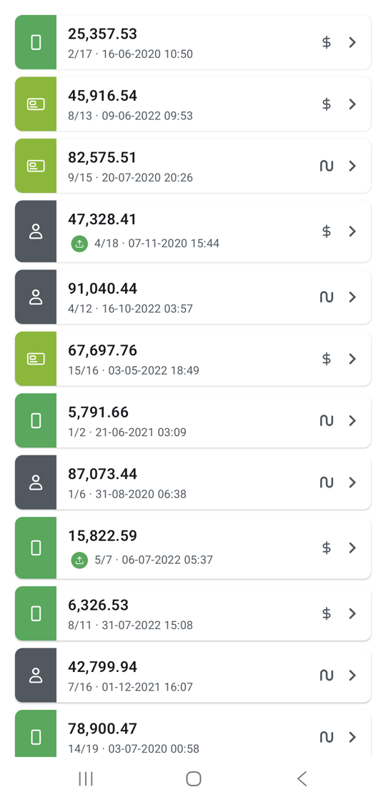 |  | 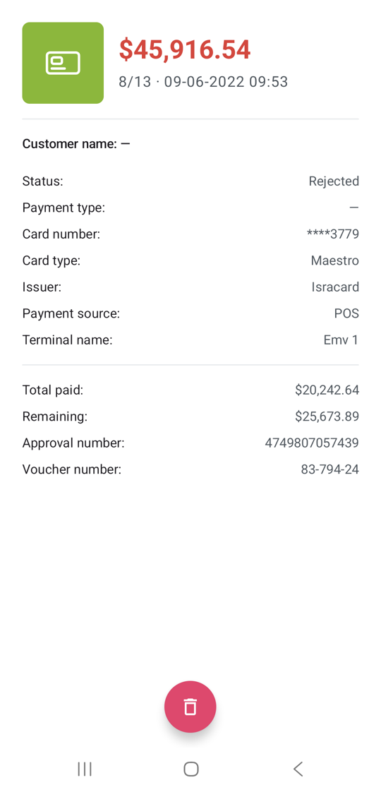 | 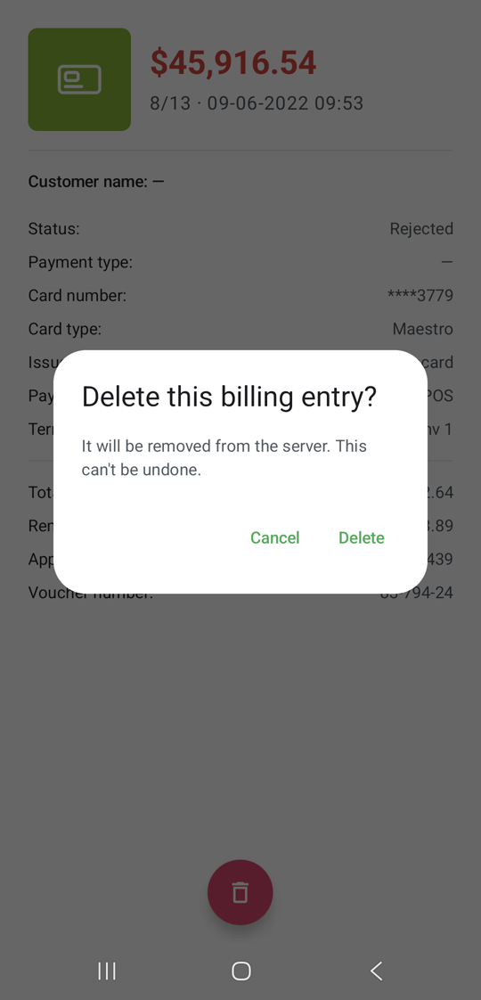 |

| List in Hebrew (as in the mockups) | Details in Hebrew | Server unreachable |
|---|---|---|
| 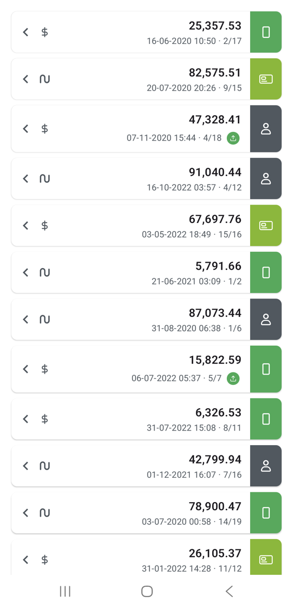 | 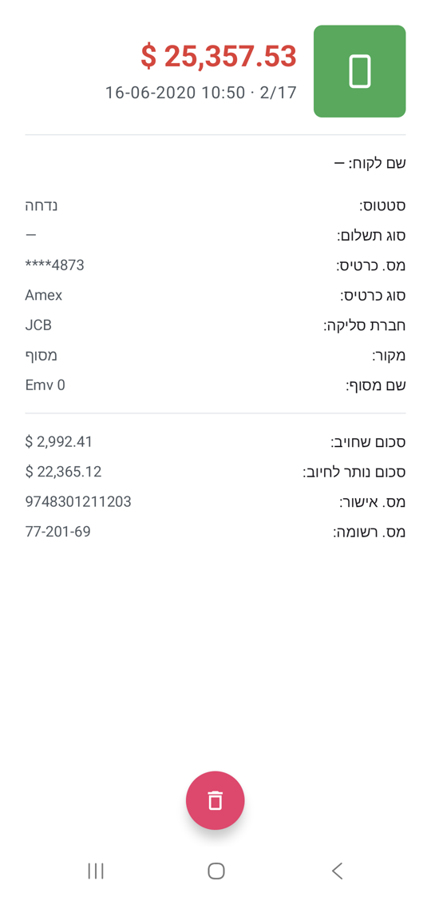 |  |

<details>
<summary>Tablet screenshots (emulator)</summary>

| List | Details (Passed) | Delete |
|---|---|---|
| 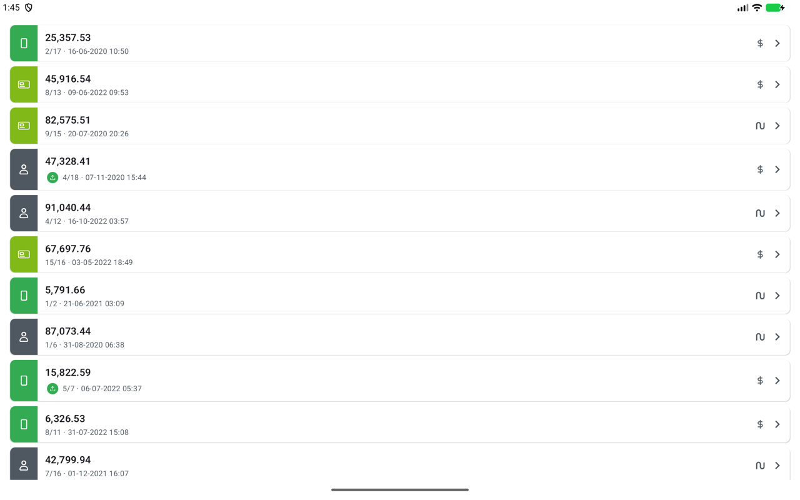 | 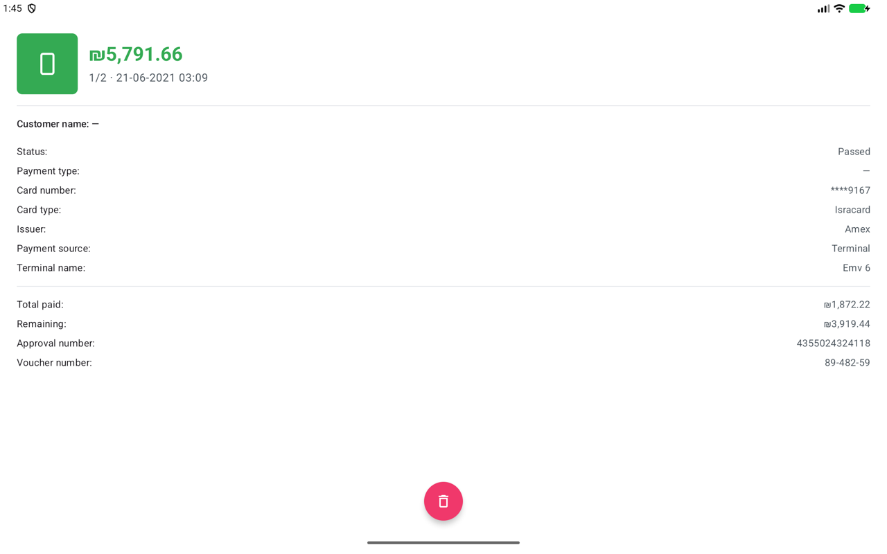 | 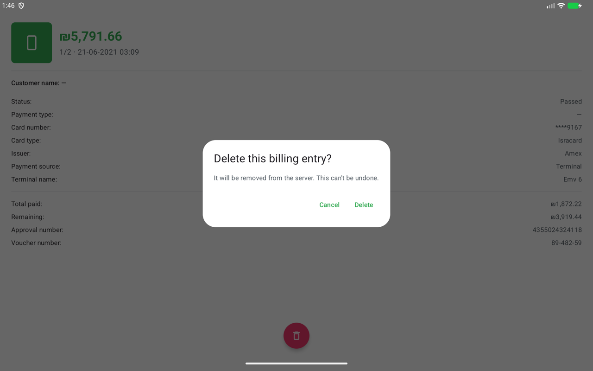 |

| List in Hebrew | Details in Hebrew (Rejected) | Server unreachable |
|---|---|---|
| 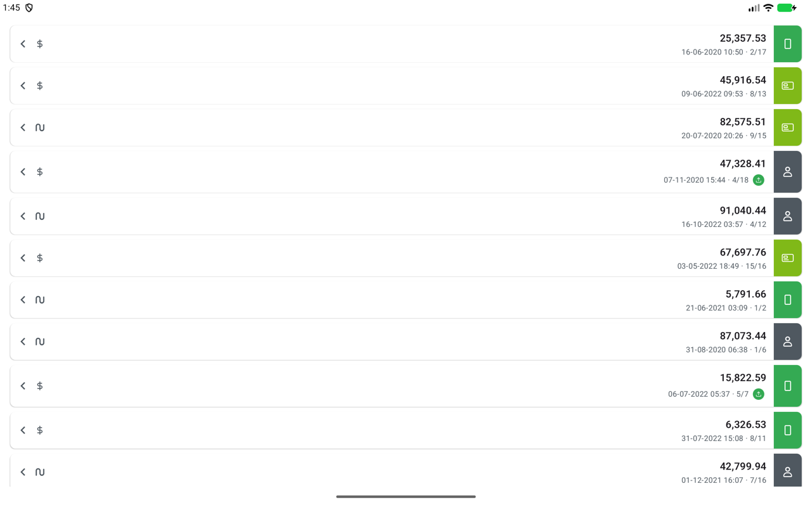 | 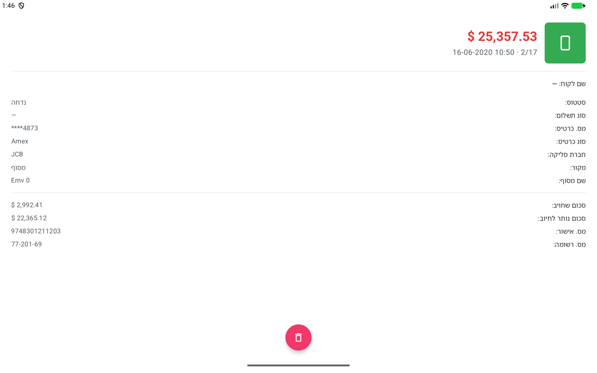 | 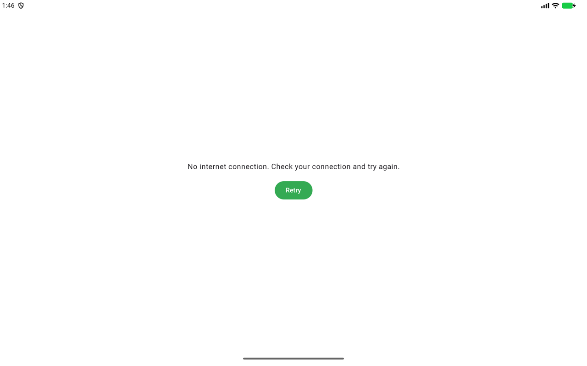 |

</details>

## Running it

**1. The server** (Node, Express):

```bash
cd server && npm install && npm run dev      # http://localhost:8030
```

| Endpoint (all `POST`, JSON body) | Body | Response |
|---|---|---|
| `/payment/billing/entry/headers` | `{}` | `{ "headers": [BillingEntryHeader] }` |
| `/payment/billing/entry/details` | `{ "billingId": 5200 }` | `{ "details": BillingEntryDetails }`, or `{ "details": null }` for an unknown id |
| `/payment/billing/entry/delete` | `{ "billingId": 5200 }` | `{ "status": 0 }` on success, `{ "status": -1 }` if the id doesn't exist |

**2. The app**: open the project in Android Studio and run `app`, or:

```bash
./gradlew installDebug
```

The app calls `http://10.0.2.2:8030/`, which is the host machine as seen from the emulator. If it
shows "No internet connection" while the server is running, the macOS firewall is probably blocking
`node`. Allow `node` in the firewall settings, or tunnel through adb (this also works on a physical
device):

```bash
adb reverse tcp:8030 tcp:8030
./gradlew installDebug -Ppayments.baseUrl=http://localhost:8030/
```

Deletes are written to the server's JSON files. Restore the data with
`git checkout server/list.json server/details.json`.

## What the task asks, and where it is

| Requirement | Implementation |
|---|---|
| Run the server; fix its delete | `server/controller.js`: `splice(index)` removed every entry from that index to the end (deleting one id left 35 of 486); now `splice(index, 1)` |
| List from `/headers` | `:feature:billinglist`, `BillingListItem` |
| 1. Source icon on its color | `BillingSourceBadge`: Terminal = phone on `#34AA53`, Pos = card on `#80B918`, Manual = person on `#4F5860` |
| 2. Price without currency symbol | `formatAmount` (`25,357.53`) |
| 3. Date `dd-MM-yyyy HH:mm` | `formatDateTime` (device time zone) |
| 4. Billing number | `entryNumber/totalEntryCount` (`2/17`) |
| 5. MasterCard → circular upload button | `CircleIconButton` with `ic_upload`, MasterCard rows only |
| 6. Currency icon / 7. Arrow | `CurrencyIcon` (`ic_ils` / `ic_dollar`), auto-mirrored arrow |
| Tap → details from `/details` | Navigation 3, `BillingDetailsKey(billingId)` |
| Details 1–4: source, price (green Passed / red Rejected), date, billing number | `BillingDetailsHeader` |
| Details 5–15: customer, status, payment type, card number, card type, issuer, source, terminal, total paid and remaining (with symbol), approval number | `BillingDetailsHeader` + `BillingDetailsFields` (plus the voucher number, shown in the mockup) |
| Delete → `/delete`, `status == 0` is success | Delete button → confirmation → back to the list, which no longer shows the entry |
| Colors and `InterviewAssets` | `PaymentsColors`, `PaymentsIcons`; all eight assets are used (including the launcher icon) |

## Architecture

```
:app ─────────────► :feature:billinglist ──┐
  │  (Navigation 3)  :feature:billingdetails ┴──► :core:ui ──► :core:designsystem
  │                                              │
  │                                              └──► :core:domain ──► :core:model, :core:common
  └──► :core:data ──► :core:network, :core:domain
```

| Module | Contents |
|---|---|
| `:core:model` | Domain models, enums with safe parsing, `Money` (pure Kotlin) |
| `:core:common` | `Result`, `AppException`, dispatcher qualifiers (pure Kotlin) |
| `:core:domain` | `BillingRepository` interface and use cases (pure Kotlin) |
| `:core:network` | Retrofit API, DTOs, `networkCall {}` mapping failures to `AppException` |
| `:core:data` | Repository with an in-memory list shared by both screens, DTO → model mappers |
| `:core:designsystem` | Theme, spec colors, icons, model-agnostic components |
| `:core:ui` | MVI base (`MviViewModel`, `UiState` / `UiEvent` / `UiAction`), formatters, billing components |
| `:core:testing` | `FakeBillingRepository`, `MainDispatcherRule`, test data |
| `:feature:*` | One screen each: Contract, ViewModel, Screen, components, navigation entry |
| `build-logic` | Convention plugins, so module build files are a few lines |

- **MVI.** Each screen has a sealed `UiState` (`Loading` / `Error` / `Success`), user `Event`s, and
  one-shot `Action`s (navigation, snackbars). The ViewModel's `handleEvent` is the only entry point,
  and each `when` branch calls one named function.
- **Features don't know each other.** `:app` connects them through Navigation 3. The back stack is a
  list of `@Serializable` keys, and each screen's ViewModel is scoped to its entry. The billing id
  reaches the details ViewModel through a Hilt assisted factory.
- **One source of truth.** The repository keeps the loaded list in memory. A delete on the details
  screen removes the entry from it, so the list updates without fetching again. Back on the list, the
  deleted row is shown for a moment and then animates out (`animateItem()`), so the user sees what
  was removed.
- **Previews.** One composable per file, each with previews in light, dark and Hebrew RTL
  (`@PreviewThemes`), one per state.

## Decisions and where the PDF and the server disagree

- **The server is the source of truth for the contract.** Verified against the running server: the
  header has no `val` field but does have `totalEntryCount` (which the "3/6" indicator needs); the
  details response matches the PDF exactly. Errors arrive as HTTP 200 with `details: null` or
  `status: -1`.
- **`created` is epoch seconds**, not milliseconds.
- **Money is never modified.** Amounts keep the server's exact value (`BigDecimal`) and are rounded
  only for display. The one calculation, remaining = price − paid (the API doesn't send it), is done
  once in the data mapper.
- **Customer name and payment type are not in the API.** They show `—` and are picked up
  automatically if the server adds them.
- **Currency symbols are the plain ones** (`$`, `₪`): the device's locale decides placement and
  separators, but an English (UK) phone shows `$28.80`, not Java's `US$28.80`.
- **Card type "Meastro"** is the server's (and the PDF's) spelling of Maestro; unknown values never
  crash parsing.
- **Icons vs. file names.** Matching the mockup's colors, Terminal is `ic_pos` (a phone) and Pos is
  `ic_card`. Manual uses the PDF's `#4F5860`, not the mockup's mustard. The PDF's "light gray"
  (`#4F5860`) is used for text and its "dark gray" (`#E3E6E9`) for dividers, since the names look
  swapped.
- **Upload button.** Shown on MasterCard rows in addition to the billing number. The task doesn't
  say what it does, so it shows "Upload is not available yet".
- **Delete asks for confirmation**, since it can't be undone.
- **Hebrew and RTL.** The mockups are Hebrew, so the app has full Hebrew strings and mirrors its
  layout. Dates and card numbers are bidi-isolated, so they keep their order in RTL.
- **Pull-to-refresh** on the list (not required).

## Problems encountered

| Problem | What I did |
|---|---|
| **Delete removed far more than one entry.** `splice(index)` in `server/controller.js` has no delete count, so it removed every entry from that index to the end (deleting one id left 35 of 486). | Fixed to `splice(index, 1)`; the delete also accepts the id as a number or numeric string. The Postman run below fails on the original server and passes on the fixed one. |
| **The PDF's header contract doesn't match the server.** The PDF lists `val: Int`; the server never sends it and sends `totalEntryCount` instead. | The DTOs follow the server (checked field by field against every response). `totalEntryCount` drives the "3/6" billing number. |
| **Customer name and payment type are required on the details screen but aren't in the API** (not in the PDF contract, the server code or its data; only in the mockup). | Shown as `—`. The fields are optional in the DTO and model, so they appear as soon as the server sends them. |
| **Remaining price isn't in the API.** | Computed once in the data mapper as `price − amountPaid` (exact `BigDecimal`); money is never modified anywhere else. |
| **`created` is epoch seconds**, and the card type `Meastro` is misspelled (in the PDF too). | Parsed as seconds; `Meastro` and `Maestro` both map to Maestro, and unknown values never crash parsing. |
| **Asset names don't match their meaning, and two spec colors look mislabeled.** `ic_pos` is a phone and `ic_card` a card; "light gray" `#4F5860` is the darker one; Manual is `#4F5860` in the PDF but mustard in the mockup. | Matched the mockup's colors (Terminal = phone, Pos = card), used the PDF's colors, named the grays by what they are (comments explain). |
| **The emulator couldn't reach the server**: the macOS firewall (stealth mode) drops incoming connections to `node`. A physical device can't use the emulator alias `10.0.2.2` at all. | `adb reverse tcp:8030 tcp:8030` plus a configurable base URL (`-Ppayments.baseUrl=http://localhost:8030/` or `local.properties`); see [Running it](#running-it). |
| **Deletes are written to the server's JSON files**, so testing deletes changes the data for everyone using that copy. | Documented `git checkout server/list.json server/details.json`; destructive tests ran against a separate copy of the server. |
| **On an English (UK) device Java writes `US$28.80`.** | The formatter always uses the plain symbol (`$`, `₪`) while the locale still decides placement and separators. |
| **In Hebrew, dates and masked card numbers reordered** (`10:50 16-06-2020`, `4873****`). | Wrapped in Unicode bidi isolation (`isolateLtr()`), so they read as in the spec. |

## Tests and checks

```bash
./gradlew spotlessCheck lintDebug test        # format, lint, 85 unit tests
./gradlew connectedDebugAndroidTest           # 8 Compose UI tests (emulator)
```

**API verification with Postman.** [`docs/api/PaymentsApp.postman_collection.json`](docs/api/PaymentsApp.postman_collection.json)
runs the three endpoints in order with assertions: field names and types the app relies on, epoch
seconds, `details: null` for an unknown id, delete status `0` then `-1`, and that a delete removes
exactly one entry. Import it into Postman (set `baseUrl`, default `http://localhost:8030`) or run it
from the command line; the delete requests change the server's data files.

```bash
npx newman run docs/api/PaymentsApp.postman_collection.json
```

| Server | Result |
|---|---|
| Original `android-test-server.zip` | 15 / 16 assertions; fails "the deleted entry is gone, and only that one" (the delete bug) |
| Fixed (`server/` in this repo) | 16 / 16 assertions pass |

- Network tests replay response bodies **recorded from the running server** and parse every entry
  of its data files.
- Mapper, repository, formatter and ViewModel tests, using fakes rather than mocks.
- Compose UI tests for the list row (upload button only on MasterCard) and the details screen.
- Checked by hand on an emulator against the server, in English and Hebrew, including delete and
  the server-unreachable error.

## Next steps with more time

- Confirm the open points with the examiner: where customer name and payment type should come
  from, `val` vs `totalEntryCount`, the Manual source color, and what the upload button should do.
- A Room cache for offline use, and paging if the list grows.
- Screenshot tests for the previews.
- A real upload action for MasterCard entries.
